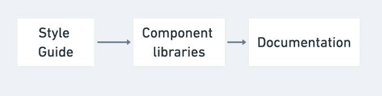
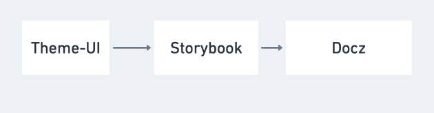
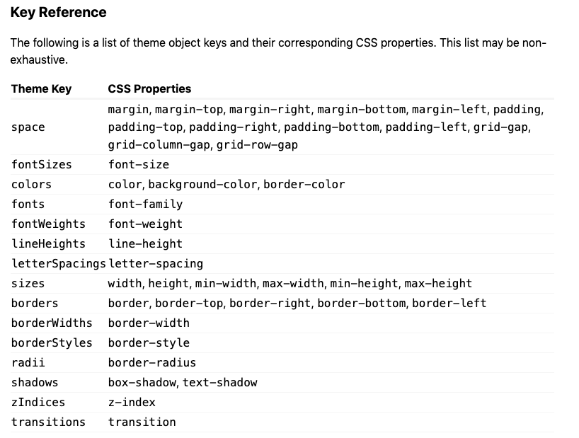
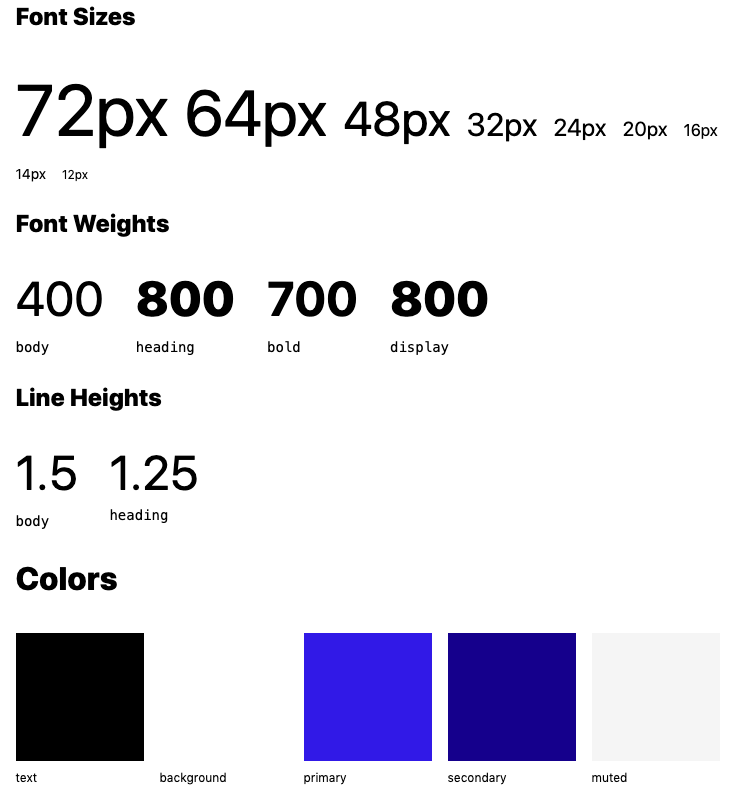

[Theme UI](https://theme-ui.com/) is a react library to style your application while keeping your design rules in check. It offers the power of **CSS-in-JS** plus **theme** building capability.
The idea is that you will define fields in a configuration file regarding colors, typography, spacing... these fields are also called **design tokens** in a design system. After that you will be able to use these values directly while styling your component.
**Design tokens** are the foundation to build a design system.

## What's the point of a design system already ?

A **design system** is the association of both a **style guide** and a **component libraries** along with a **documentation** explaining principles and patterns behind the design.
It helps to ensure that the application is build with a coherent and consistent design that will scale over time.

If you're not familiar with **design system**, I recommend you the [article](https://leerob.io/blog/style-guides-component-libraries-design-systems/) of Lee Robinson.

## Where does Theme-UI fit into a design system ?

**Theme-UI** allows you to implement the **design tokens** of a **style guide** and made them dynamic.
What I mean by dynamic, it's that they can be changed easily instead of writing them directly in your components.
For instance, you could change the primary color of all your components at once if you wanted to.



<div style={{ textAlign: "center", fontWeight: "bold", marginBottom: "30px" }}>
  The three main pieces of a design system
</div>

Here’s an example of what this workflow could look like with Theme-UI and other tools.



<div style={{ textAlign: "center", fontWeight: "bold", marginBottom: "30px" }}>
  Tooling workflow example to implement a design system
</div>

## Why would you need this ?

So why would you need to have a design system with dynamic **design tokens** ? You could be thinking: “I’m going to implement a figma or sketch design directly, I don’t need to include the designer language directly into the front end”.
Well to me a front-end without dynamic **design tokens** looks like this:


<div style={{ textAlign: "center", marginBottom: "30px" }}>
  Photo by{" "}
  <a href="https://unsplash.com/@a_mfelipe?utm_source=unsplash&utm_medium=referral&utm_content=creditCopyText">
    Antônia Felipe
  </a>
</div>

It’s like buildind a stone statue. At the end of the integration process, you‘ll have what you wanted but at the cost of zero flexibility.

This approach leads to the following problems:

- **Design inconsistency:**
  At some point in the development, the implemented design will defer from the original design, this will create inconsistency between your pages and components.
- **Longer integration in the long run**
  Since you have to write design rules all over again, it is time consuming.
- **Design lock-in**
  Once you have integrated all your design screen, your kind of locked in to that design. Minor design changes could cost a lot of time since they have to be replicated on all the components/pages. For major changes or redesign you usually have to start from scratch leading a recurrent important cost as you decide to evolve your design.
- **No personalization**
  You can’t offer any customization option to your user.

Hardcoding the design into our frontends seems like a terrible idea, so why are we still doing it ?
Let's see how can Theme-UI helps us with these problems.

## So how does Theme-UI works ?

To implement your style guide as your base theme, you have to create a configuration file that follow the [System UI](https://system-ui.com/theme/) specification. The specification follows these fields:



That means that every **CSS property** above will follow your theme and will be dynamic. Hower you don’t have to specify all theme keys in your theme.
Having all your **design tokens** declared once will help build your **components libraries** with the insurance that you’re respecting your design rules.

This specification is already being adopted by several react components UI libraries:

- https://chakra-ui.com/
- https://rebassjs.org/

It means that you can use existing components from these UI libraries along with yours while keeping a consistent design !

To start building your theme you can use one of the following options:

- https://theme-ui.com/customize
- [Start with a preset](https://theme-ui.com/presets/)
- https://design-system-playground.netlify.com/


Fields will be defined as either plain object or array of values.

Array example:

```js
fontSizes: [
12, 14, 16, 20, 24, 32, 48, 64,
],
```

Plain object example:

```js
colors: {
text: '#000',
background: '#fff',
primary: '#07c',
secondary: '#05a',
accent: '#609',
muted: '#f6f6f6f',
},
```

For the typography fields you can also use a predefined set of values using [**Typography.js**](https://theme-ui.com/typography).

Once your theme is ready, it is time to apply it in your components. In order to do so you have to use the [sx prop](https://theme-ui.com/sx-prop/). It combines your theme properties with **Emotion** jsx function.

To use the theme properties you just have to use the value directly if it’s an object or the index of the array if it’s an array. For object you don’t have to follow a specific pattern, but for interoperability purpose Theme-UI propose a [base format](https://theme-ui.com/theming) for colors and typography elements.

```js
<div
  sx={{
    color: "primary",
    bg: "lightgray",
    fontFamily: "body",
    fontSize: 2
  }}
/>
```

Also all properties can be specified for **responsive**. In your configuration file you can defined the values of your **breakpoints** like this:

```js
breakpoints: [
'40em', '56em', '64em',
],
```

And in your component you can use an array on all your properties to apply it to specific breakpoints:

```js
<div
  sx={{
    width: ["100%", "50%", "25%"]
  }}
/>
```

## Alternative ways to style your components:

- **Variant**:

  In your configuration file you can define keys outside of the specification and define groups of style inside. This allows to reuse these groups within your components.

  ```js
    buttons: {
    primary: {
      color: 'white',
      bg: 'primary',
    },
    secondary: {
      color: 'white',
      bg: 'secondary',
    },
  },
  ```

- **Styled**:

  It’s a component that you can import from Theme-UI.

  ```jsx
  <Styled.h1>Hello, styled heading!</Styled.h1>
  ```

In this example **Styled.h1** will create a h1 using style defined in themes.style under the h1 key.
This component is useful to replace global style.

- **@theme-ui/components**:

  It’s an optional package that provides pre-built components (Button, Card, Grid, Froms …) to make styling quicker.

  ```js
  <Box p={4} bg="highlight">
    <Flex
      sx={{
        alignItems: "center"
      }}
    >
      <Heading>Components</Heading>
      <Button ml="auto">Beep</Button>
    </Flex>
  </Box>
  ```

## Bonus

- **Gatsby integration**

  Theme-UI can be used with [**Gatsby**](https://www.gatsbyjs.org/) by using a plugin. Theme-UI also powers the latest Gatsby feature: **Theme**. This is out of the scope of this article but Theme is a really interesting feature and it makes a lot of sense to use Theme-UI for that. In short, Theme are pre built gatsby sites that you can customize. You can apply your own styling using Theme-UI or changing some part of the sites by overriding components as you need. I really like this idea because you can make a **Gatbsy Theme** your own as your needs evolve without having to deal with the whole complexity of a site from the start.

- There is a [plugin](https://theme-ui.com/gatsby-theme-style-guide) that generates a page for your style guide based on your configuration file.



- There are also two **hooks** available:

  - For accessing your theme object
  - For switching the color mode of your site. It offers customization of your website to your users for free.

## Conclusion

Until now we have been considering our design as a static entity. We should make them dynamic from the start so they can evolve over time instead of once every few years.
This article focuses on Theme-UI as it's a clever way to solve this problem. It could be addressed with other tools but maybe with less flexibility.

Theme-UI is still in its early phase but it looks very promising, especially since it has strong support from the Gatsby team. Gatbsy theme is already a great example of what can be accomplished with Theme-UI. I personally believe that Theme-UI brings a lot to the table and I’m looking forward to see it growing.
In the meantime, I encourage you to give it a try for your next side projects. Happy theming.

## Resources:

- https://theme-ui.com/
- https://system-ui.com/
- https://design-system-playground.netlify.com/
- https://leerob.io/blog/style-guides-component-libraries-design-systems/
