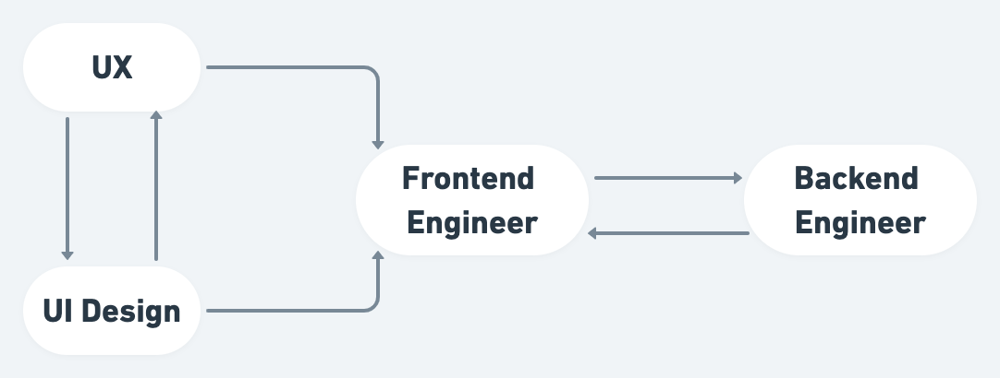
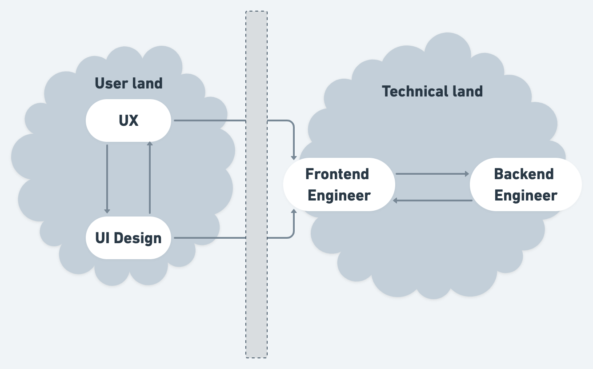

Last year I focused mainly on **web performance**, it’s a large topic and I learned a lot. I wrote two articles (in french), one on building a [web performance culture](https://blog.octo.com/introduire-une-culture-de-la-performance-web-sur-son-projet/) and an other one on [rendering performance](https://blog.octo.com/analysez-les-performances-de-rendu-de-son-interface-avec-du-profiling/). Next year I will continue digging and exploring techniques to build effecient user interface but I’m going to shift my main focus to another area. In late 2019 I started thinking about what makes a good interface in general. I still had in mind the article [The elements of UI Engineering](https://overreacted.io/the-elements-of-ui-engineering/) by **Dan Abramov** that extended my view on this perspective.

In 2020 I want to explore all the areas that can help me produce better UI. My conviction right now is that Frontend engineers, like me, lack knowledge in **User Experience** and **User Interface Design**. I feel there is a gap between the people designing the user interface and the people building it. Often engineers are given static images to build a UI, but an interface is anything but static. Even the most basic websites have to deal with, navigation, scrolling, images, network. More complex sites with interactions have to deal with making the actions on the site understandable, responsive and handle any errors that could happen in the process. The point is that tools that produce static output can't take into account the whole complexity of a website with a lot of interactions.
I'm not saying that these tools shouldn't be used at all but rather that we need more steps in the design process to fill the gaps.

When an engineer encounters a situation that have not been planned initially, he will try its best to handle it. That’s when things can start to go wrong because, despite all his good will, an
engineer is used to solve the issue from a technical point of view. Looking to an interface from a user perspective is really not easy because without specific knowledge, engineers only have their our own experience to do so.

  Common communication flow between product teams members

Frontend developers are at the frontier between UI Design / UX, yet they are not generally expected to be involved in the design process of an interface. On the contrary communication between Frontend developers and Backend developers is usually more natural.
Why is it so common to have these unidirectional communication between Frontend Engineers and design teams ? I don’t really know how to call this, but it’s like there is an invisible gap between the user and technical land.

  Invisible gap between product design and technical team members

On the one side there are people designing an interface and on the other side there are people building it. Designing and building are usually considered two distinct processes with few interactions. Frontend engineers might consider that the knowledge of the user land is out of their area since it’s not technical and the same thing goes for the user land team. Is that gap too wide and deep to be closed ? I don’t think so, and I think that as Frontend Engineers we can contribute to improve this disfunctionnal workflow.

I think we can start with these two steps:

- Get basic knowledge of both UX and UI design fields so we can speak the same language with the user land team
- Build a common medium of exchange with the user land team

The ultimate goal is that both sides could work on the same tool at the same time. It would make the final interface tremendously better for user.

The good news is that things start to evolve in that direction. The emergence of [design system](https://www.flagrede.com/blog/theme-ui/) is an attempt to solve this issue. However design system alone won’t solve the whole problem, at least some pieces are still missing. We still lack the proper tooling to have all the team work on the same final output, we might need to reconsider visual coding editor ([Modulz](https://www.modulz.app/) looks very promising in that regard). However it’s not just a tooling problem, Front-End developers might need to change the way they see their work and why they did it. The fact is we are not just building components, we are building **interfaces** for **users**, maybe we should start to call our job title **UI Engineer** instead for starter, to keep in mind what we are building and for whom.

  Ideal communication flow between product teams members

My goal for 2020 is to build knowledge on both UX and UI design so I can experiment with ideas and solutions for making better interface for user. I will try to share my progress along the year with articles. In the meantime if this subject talks to you, don’t hesitate to chat with me on [twitter](https://twitter.com/FlowLag), see you then!
